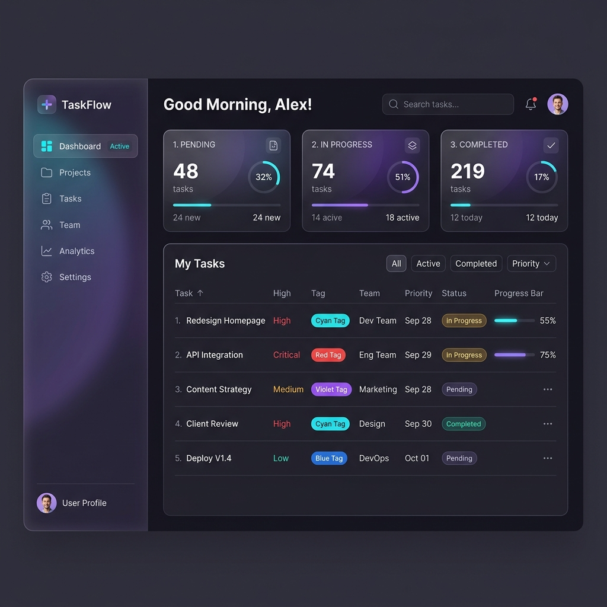

# Scalable Auth RBAC Task API

# Project Overview
This project is a task management application featuring user authentication and Role-Based Access Control (RBAC). It is structured as a monorepo containing a Node.js/Express backend API connected to MongoDB, and a React frontend client dashboard built with Vite. It demonstrates clean coding patterns, secure endpoint authorization, and modern UI design.

# Features

### Backend Features
* **JWT Authentication**: Secure user login and registration with hashed passwords.
* **RBAC Authorization**: Endpoint protection restricting normal users to their own tasks while allowing admins full control over all tasks.
* **Input Validation**: Request payload filtering using `express-validator`.
* **Security & Optimization**: Basic protection using CORS, Helmet security headers, rate-limiting, and response compression.
* **Logging & Docs**: Winston logger integration and interactive Swagger API documentation.

### Frontend Features
* **Role-Based Routing**: Conditional page access and layout adjustments based on the user's role.
* **Interactive Dashboard**: Dynamically displays task status metrics and filtering criteria.
* **State Management**: Context API to synchronize user login status and JWT authentication.

# Tech Stack
* **Backend**: Node.js, Express.js, MongoDB, Mongoose, JSONWebToken, BcryptJS, Winston, Swagger
* **Frontend**: React.js, Vite, Axios, React Router, Vanilla CSS

# Folder Structure
```text
scalable-auth-rbac-task-api/
├── backend/                  # Express REST API Server
│   ├── config/               # Database and logger configs
│   ├── controllers/          # Express route handler controllers
│   ├── middleware/           # Auth, RBAC, and error handlers
│   ├── models/               # MongoDB models (User, Task)
│   ├── routes/               # API endpoint routing
│   └── services/             # Core business logic services
└── frontend/                 # React SPA Dashboard Client
    ├── src/
    │   ├── components/       # Reusable layout and form components
    │   ├── context/          # React Auth Context
    │   ├── hooks/            # Custom state hooks (useAuth, useTasks)
    │   └── pages/            # Login, Register, Tasks, and Dashboard pages
```

# Installation
1. Clone the repository:
   ```bash
   git clone https://github.com/0xAnandDev/scalable-auth-rbac-task-api.git
   cd scalable-auth-rbac-task-api
   ```
2. Set up backend dependencies:
   ```bash
   cd backend
   npm install
   ```
3. Set up frontend dependencies:
   ```bash
   cd ../frontend
   npm install
   ```

# Environment Variables
Create a `.env` file in the `backend/` directory with the following variables:
* `PORT`: Server port (default: 5000)
* `NODE_ENV`: Application mode (`development` or `production`)
* `MONGODB_URI`: MongoDB connection string
* `JWT_SECRET`: Secret key used for signing tokens
* `JWT_EXPIRES_IN`: Token validity period (e.g., `1d`)
* `CORS_ORIGIN`: Allowed client origins

# Running the Project
1. **Database Seeding**: Create a default admin account (`admin@taskmanager.com` / `AdminPassword123`):
   ```bash
   cd backend
   npm run seed
   ```
2. **Start Backend**:
   ```bash
   npm run dev
   ```
3. **Start Frontend**:
   ```bash
   cd ../frontend
   npm run dev
   ```

# API Endpoints
All API endpoints are versioned under `/api/v1`.

### Authentication (`/api/v1/auth`)
* `POST /register`: Registers a new user account.
* `POST /login`: Log in to get a JWT token.
* `GET /me`: Get profile details of the authenticated user.

### Tasks (`/api/v1/tasks`)
* `POST /`: Create a new task (automatically assigned to the logged-in user).
* `GET /`: Retrieve tasks (filtered by `status` or `priority`). Users see only their own tasks; admins see all tasks.
* `GET /:id`: Get details for a specific task.
* `PUT /:id`: Update task properties.
* `DELETE /:id`: Delete a specific task.

### Health (`/api/v1/health`)
* `GET /`: Check server uptime and database connection status.

# Screenshots
### Dashboard Interface


# Scalability
* **Service Decoupling**: Separation of controllers and services makes it easy to migrate modules into independent microservices.
* **Stateless Sessions**: Relies completely on signed JWTs, allowing backend server instances to scale horizontally behind a load balancer.
* **Database Optimization**: Added single-field and compound indexes on tasks (`owner`, `status`, `priority`) to guarantee fast database reads under load.
* **API Versioning**: Standardized `/v1/` prefix helps deploy new API iterations without breaking legacy integrations.
* **Rate Limiting**: Defends server memory and database from brute-force scripts and excessive api requests.

# Future Improvements
* **Secure Cookie Storage**: Store JWT tokens in `httpOnly` secure cookies instead of LocalStorage.
* **Refresh Token Rotation**: Implement short-lived access tokens paired with rotating refresh tokens.
* **Docker Support**: Containerize the app, db, and caching layers with a unified `docker-compose.yml`.
* **Testing Suite**: Add automated unit and integration tests using Jest, Supertest, and React Testing Library.
* **Caching Layer**: Set up a Redis cache to optimize frequent queries like user profiles and dashboard statistics.

# Developer
* **Name**: Anand Dev
* **GitHub**: [@0xAnandDev](https://github.com/0xAnandDev)
