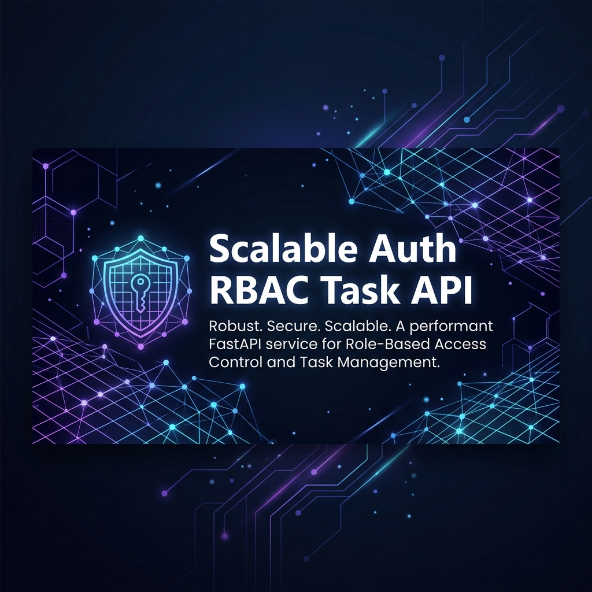
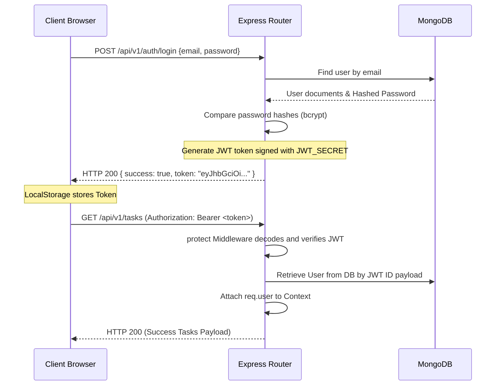

# Scalable Auth RBAC Task API & Dashboard



[](https://opensource.org/licenses/ISC)
[](https://nodejs.org/)
[](https://vitejs.dev/)
[](https://www.mongodb.com/)
[](https://react.dev/)

A production-ready, interview-friendly monorepo designed with a clean separation of concerns, modularity, and high scalability. This project contains a robust backend REST API built with Node.js, Express, and MongoDB, protected by JWT stateless authentication and granular Role-Based Access Control (RBAC), alongside a modern React+Vite frontend dashboard.

---

## 📖 Table of Contents
1. [Project Overview](#-project-overview)
2. [Features](#-features)
3. [Tech Stack](#-tech-stack)
4. [Folder Structure](#-folder-structure)
5. [Installation & Setup](#-installation--setup)
6. [Environment Variables](#-environment-variables)
7. [How to Run](#-how-to-run)
8. [API Endpoints Reference](#-api-endpoints-reference)
9. [Authentication Flow](#-authentication-flow)
10. [Role-Based Access Control (RBAC)](#-role-based-access-control-rbac)
11. [Swagger Documentation](#-swagger-documentation)
12. [Postman Collection](#-postman-collection)
13. [Screenshots & UI Previews](#-screenshots--ui-previews)
14. [Scalability Design Patterns](#-scalability-design-patterns)
15. [Future Improvements](#-future-improvements)
16. [Developer Information](#-developer-information)

---

## 🔍 Project Overview

This repository is structured as a monorepo consisting of:
*   **`backend`**: A RESTful Web API employing **MVC + Services Architecture**, strict validator schemas, centralized error logging (using Winston & Morgan), security middleware layers (rate limiting, helmet headers, compression), and interactive Swagger specifications.
*   **`frontend`**: A state-of-the-art Single Page Application (SPA) dashboard crafted with React and Vite. It utilizes custom React hooks and Context API state management for smooth token-based sessions, layout shell wrapping, and role-based views.

By separating domain business logic into dedicated **Services** and decoupling payload serialization and HTTP requests inside **Controllers** and **Routes**, this architecture is optimized for testability, enterprise scaling, and clean maintenance.

---

## ✨ Features

### Backend (REST API)
*   🔑 **Sessionless JWT Auth**: Secure, stateless user authentication utilizing signed JSON Web Tokens.
*   🛡️ **Granular RBAC**: Flexible role authorization (`USER` & `ADMIN`) protecting endpoints. Admins gain total system visibility, while users are restricted strictly to resources they own.
*   🚦 **Rate Limiting**: Defends endpoints against brute force and DDoS attacks via `express-rate-limit`.
*   🔒 **Production Security**: Security headers handled by `helmet`, strict `cors` setup, password hashing via `bcryptjs`, and body size sanitization.
*   📉 **Response Compression**: Network bandwidth reduction using Gzip compression (`compression`).
*   📝 **Centralized Logging**: `morgan` server logs piped directly into structured daily rotation log files and console formats via `winston`.
*   🚀 **API Versioning**: Future-proof versioned architecture (`/api/v1/...`).
*   📚 **Interactive Swagger API Docs**: Self-documenting Swagger UI interface generated automatically via JSDoc schemas.

### Frontend (React Client)
*   🔐 **Role-Protected Routing**: Client routes and UI navigation elements dynamically adapt to user permissions.
*   📊 **Aesthetic Analytics Dashboard**: Visual display of task metrics (Pending, In Progress, Completed) sorted by priority levels.
*   ⚡ **Vite Reverse Proxy**: Seamless endpoint redirection avoiding cross-origin (CORS) preflight blockages on localhost.
*   🔄 **Centralized State**: Context API state providers that automatically intercept token expirations and synchronize auth headers across requests.

---

## 🛠️ Tech Stack

### Backend Service
| Technology | Description |
| :--- | :--- |
| **Node.js** | JavaScript Runtime Environment (ES Modules) |
| **Express.js** | REST API Routing & Web Middleware Framework |
| **MongoDB & Mongoose** | Document-oriented Database & ODM schema modeling |
| **JSONWebToken (JWT)** | Stateless cryptographically signed auth tokens |
| **BcryptJS** | Blowfish-based password hashing |
| **Express Validator** | Declarative request payload validations |
| **Winston & Morgan** | Structured logging framework and HTTP request stream Logger |
| **Swagger UI Express** | API interactive sandbox documentation generator |
| **Helmet & CORS** | HTTP security header injection & Origin configuration |

### Frontend Application
| Technology | Description |
| :--- | :--- |
| **React** | Component-driven UI library (v18+) |
| **Vite** | Lightning-fast frontend build tool and hot dev server |
| **Axios** | Promised-based HTTP client for service request layer |
| **React Router DOM** | Declarative client-side SPA routing engine |
| **Vanilla CSS** | Modern CSS layouts and custom property color design system |

---

## 📂 Folder Structure

```text
scalable-auth-rbac-task-api/
├── README.md                      # Main Monorepo root documentation
├── backend/                       # Express REST API Server
│   ├── config/                    # DB connection, Winston Logger configuration
│   ├── controllers/               # Express Controllers (Auth, Task operations)
│   ├── docs/                      # Swagger configuration and setups
│   ├── middleware/                # Protect, Authorize, Error, & Validation middlewares
│   ├── models/                    # Mongoose Database Entity Schemas (User, Task)
│   ├── routes/                    # Versioned endpoint routers (v1)
│   ├── seed/                      # Database initial seeding scripts
│   ├── services/                  # Core Domain business logic layers
│   ├── utils/                     # Custom ApiError, ApiResponse, logger utilities
│   ├── validators/                # express-validator schemas (payload checks)
│   ├── .env.example               # Example configurations template
│   ├── app.js                     # Express app middlewares composition
│   ├── server.js                  # App bootstrap and database connection
│   └── package.json               # Backend dependencies & npm scripts
├── frontend/                      # React SPA Dashboard Client
│   ├── src/
│   │   ├── components/            # UI components (Common UI, Forms, Modals)
│   │   ├── context/               # Auth Context for user state & session sync
│   │   ├── hooks/                 # Custom Hooks (useAuth, useTasks)
│   │   ├── layouts/               # Dashboard Shell, Sidebar and Navbar components
│   │   ├── pages/                 # Login, Register, Task Boards, Dashboard panels
│   │   ├── services/              # Axios instance configuration & API requests
│   │   └── utils/                 # Formatting utility helpers
│   ├── index.html                 # Main HTML DOM entry point
│   ├── vite.config.js             # Vite compiler & reverse proxy settings
│   └── package.json               # Frontend dependencies & npm scripts
├── postman/                       # Exported Postman collections
└── screenshots/                   # Generated mock visual references
```

---

## ⚙️ Installation & Setup

### Prerequisites
*   **Node.js** (v16.0.0 or higher)
*   **MongoDB** (Local daemon running or MongoDB Atlas connection string URI)

### Setup Instructions

1. **Clone the Repository:**
   ```bash
   git clone https://github.com/0xAnandDev/scalable-auth-rbac-task-api.git
   cd scalable-auth-rbac-task-api
   ```

2. **Backend Configuration:**
   Navigate into the backend directory, duplicate the environment template, and fill in the values:
   ```bash
   cd backend
   cp .env.example .env
   npm install
   ```

3. **Database Seeding:**
   Populate the database with a default System Admin account:
   ```bash
   npm run seed
   ```

4. **Frontend Configuration:**
   Navigate into the frontend folder and install its dependencies:
   ```bash
   cd ../frontend
   npm install
   ```

---

## 🔒 Environment Variables

Create a `.env` file in the `/backend` folder using the variables listed below:

| Variable Name | Required | Default Value | Description |
| :--- | :--- | :--- | :--- |
| `PORT` | No | `5000` | Port number the backend server listens on |
| `NODE_ENV` | Yes | `development` | Environment mode (`development` or `production`) |
| `MONGODB_URI` | Yes | `mongodb://localhost:27017/scalable_auth_rbac_db` | Connection URI for the MongoDB server |
| `JWT_SECRET` | Yes | `your_super_secret_jwt_key_change_in_production` | Cryptographic secret for signing JWTs |
| `JWT_EXPIRES_IN`| No | `1d` | Token validity duration |
| `CORS_ORIGIN` | No | `http://localhost:5173` | Allowed Client URLs (comma-separated origins) |

---

## 🚀 How to Run

For complete local testing, launch both services.

### Start the Backend Server
From the `/backend` directory:
*   **Development Mode** (auto-reloads on file changes using `nodemon`):
    ```bash
    npm run dev
    ```
*   **Production Mode**:
    ```bash
    npm run start
    ```
The backend API server will run at: `http://localhost:5000`

### Start the Frontend Server
From the `/frontend` directory:
*   **Development Mode**:
    ```bash
    npm run dev
    ```
The client dashboard will run at: `http://localhost:5173`

---

## 🛣️ API Endpoints Reference

All API calls are versioned under `/api/v1` and return standardized responses:
```json
{
  "statusCode": 200,
  "data": { ... },
  "message": "Operation successful",
  "success": true
}
```

### Authentication Endpoints (`/api/v1/auth`)
| Method | Endpoint | Auth Required | Description | Request Body Parameters |
| :---: | :--- | :---: | :--- | :--- |
| `POST` | `/register` | None | Register a new account | `name`, `email`, `password`, `role` (optional) |
| `POST` | `/login` | None | Log in and get JWT token | `email`, `password` |
| `GET` | `/me` | JWT | Get current user's profile | *None (bearer token in header)* |

### Tasks Endpoints (`/api/v1/tasks`)
| Method | Endpoint | Auth Required | RBAC Level | Description |
| :---: | :--- | :---: | :---: | :--- |
| `POST` | `/` | JWT | User / Admin | Create a new task. Owner is automatically set to request sender |
| `GET` | `/` | JWT | User / Admin | Retrieve tasks. Standard `USER` gets only owned tasks. `ADMIN` gets all system tasks. Supports query filter flags: `?status=...&priority=...` |
| `GET` | `/:id` | JWT | User / Admin | Fetch details for a specific task. Standard `USER` can only fetch their own tasks |
| `PUT` | `/:id` | JWT | User / Admin | Update a task. Standard `USER` can only edit their own tasks |
| `DELETE`| `/:id` | JWT | User / Admin | Delete a task. Standard `USER` can only delete their own tasks |

### Utility Endpoints (`/api/v1/health`)
| Method | Endpoint | Auth Required | Description |
| :---: | :--- | :---: | :--- |
| `GET` | `/health` | None | Returns backend status, uptime and server timestamp |

---

## 🔑 Authentication Flow



1. **Token Generation:** Upon successful login or registration, the backend signs a JWT with the user's ID as payload using the `JWT_SECRET`.
2. **Token Verification:** The client sends the JWT inside the HTTP request headers: `Authorization: Bearer <token>`.
3. **Session Handling:** The frontend uses React Context to share credentials, storing the token inside `localStorage` for persistent logins. If an API request encounters a `401 Unauthorized` response, the client interceptor clears the credentials and prompts a logout.

---

## 🛡️ Role-Based Access Control (RBAC)

The system leverages roles to restrict endpoints, implemented via dynamic checks at the database query level:

*   **`USER` Role:**
    *   Can create tasks (assigned to themselves).
    *   Can only query, read, edit, or delete tasks they own.
    *   Any attempt to read or modify another user's task ID will yield a `403 Forbidden` response.
*   **`ADMIN` Role:**
    *   Can view, modify, or delete any task across all users in the system.
    *   Receives the complete list of system tasks when querying `GET /api/v1/tasks`.

### Code Implementation Showcase
The authorization logic resides securely in the Service layer, keeping Controller and Route endpoints declarative:

```javascript
// backend/services/task.service.js
const getTaskById = async (taskId, userId, userRole) => {
  const task = await Task.findById(taskId).populate('owner', 'name email role');
  if (!task) {
    throw new ApiError(404, 'Task not found');
  }

  // Ownership security check
  if (userRole !== ROLES.ADMIN && task.owner._id.toString() !== userId.toString()) {
    throw new ApiError(403, 'Access denied: You do not own this task');
  }

  return task;
};
```

---

## 📚 Swagger Documentation

The API comes with built-in interactive Swagger UI documentation. 

*   **Default Local Route:** [http://localhost:5000/api-docs](http://localhost:5000/api-docs)
*   **Implementation details:** Configured using `swagger-jsdoc` decorators which compile dynamic YAML descriptions into a JSON schema inside `backend/docs/swagger.js`, served through Express using `swagger-ui-express`.

---

## 📬 Postman Collection

A pre-configured Postman Collection is available in this repository at:
📂 [postman/task-api.postman_collection.json](file:///d:/scalable-auth-rbac-task-api/postman/task-api.postman_collection.json)

### Importing instructions:
1. Open Postman, click **Import** in the top-left, and select the JSON collection file.
2. The collection defines a `baseUrl` variable defaulted to `http://localhost:5000/api/v1`.
3. The **User Login** request includes a post-response test script that extracts the JWT token from the login response and saves it as a dynamic environment variable named `jwtToken`:
   ```javascript
   var jsonData = pm.response.json();
   if (jsonData.data && jsonData.data.token) {
       pm.environment.set("jwtToken", jsonData.data.token);
   }
   ```
4. Authenticated endpoints will automatically reference `{{jwtToken}}` in their Bearer Auth configuration.

---

## 🖼️ Screenshots & UI Previews

### Dashboard Interface Layout
A modern, dark-mode dashboard providing real-time task status overviews and advanced filtering interfaces:


---

## 📈 Scalability Design Patterns

This system was engineered with scalability and high-availability patterns in mind:

1.  **MVC + Services Separation:** Clean separation of concerns allows components to scale independently. Controllers handle routing serialization, while services contain database operations. This makes migrating specific logic (e.g., notification systems, file parsers) into standalone microservices straightforward.
2.  **Stateless JWT Security:** The server does not maintain user sessions in memory. Authenticators verify user identity cryptographically using the JWT payload, allowing Express instances to scale horizontally behind a load balancer without needing synchronized session stores.
3.  **V1 Route Versioning:** API routes are prefixed under `/api/v1/`. This enables releasing new APIs under `v2/` without breaking legacy endpoints used by existing clients.
4.  **Database Indexing & Population:** Database queries use Mongoose populations selectively to keep document transfer sizes small. In production, indexing key filters (such as `owner` and `status` fields) ensures fast query processing.
5.  **DDoS Protection & Rate-Limiting:** Request rate limit windows prevent memory exhaustion and resource allocation bottlenecks by restricting aggressive clients to a maximum of 100 requests every 15 minutes.

---

## 🔮 Future Improvements

While this monorepo is fully functional, the following improvements can be made for production environments:
*   🔄 **Refresh Token Rotation:** Move token storage from `localStorage` to `httpOnly` secure cookies, and implement refresh token logic to limit access token lifespan.
*   🐋 **Docker Containerization:** Dockerize the backend, frontend, and MongoDB services using a unified `docker-compose.yml` configuration for seamless container deployments.
*   🚀 **Redis Caching:** Set up a Redis layer for Caching queries (like user profile info and dashboard metadata) to reduce database read latencies.
*   🧪 **Automated Testing Suite:** Write backend integration tests using `Supertest` & `Jest`, and frontend component tests using `React Testing Library` and `Vitest`.
*   🤖 **CI/CD Workflows:** Implement a GitHub Actions workflow that executes validation tests and runs linter checks on every pull request.

---

## 👨‍💻 Developer Information

*   **Lead Developer**: Anand Dev
*   **GitHub Profile**: [@0xAnandDev](https://github.com/0xAnandDev)
*   **Repository Location**: [https://github.com/0xAnandDev/scalable-auth-rbac-task-api.git](https://github.com/0xAnandDev/scalable-auth-rbac-task-api.git)
*   **Target Domain**: Production-grade authentication architectures and role-based tasks orchestrators.
